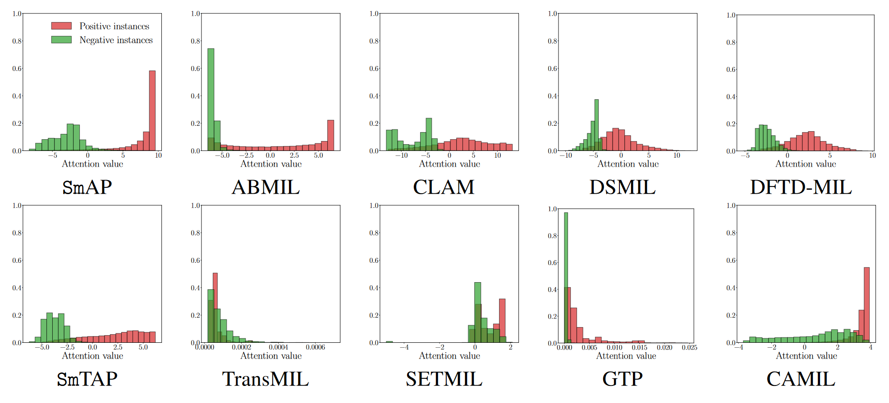

<br />
<div align="center">
    <h1 align='center'>
        Sm: enhanced localization in Multiple Instance Learning for medical imaging classification [<a href="https://arxiv.org/abs/2410.03276">arXiv</a>]
    </h1>
    <a align="center">
        
    </a>
</div>


<!-- 

This repository contains the code for the paper "Sm: enhanced localization in Multiple Instance Learning for medical imaging classification" (NeurIPS 2024). 

---- 
-->

## Overview

Multiple Instance Learning (MIL) is widely used in medical imaging classification to reduce the labeling effort. While only bag labels are available for training, one typically seeks predictions at both bag and instance levels (classification and localization tasks, respectively). Early MIL methods treated the instances in a bag independently. Recent methods account for global and local dependencies among instances. Although they have yielded excellent results in classification, their performance in terms of localization is comparatively limited. We argue that these models have been designed to target the classification task, while implications at the instance level have not been deeply investigated. Motivated by a simple observation -- that neighboring instances are likely to have the same label -- we propose a novel, principled, and flexible mechanism to model local dependencies. It is called **Smooth Operator (Sm)**, and it can be used alone or combined with any mechanism to model global dependencies (e.g., transformers). A thorough empirical validation shows that our module leads to state-of-the-art performance in localization while being competitive or superior in classification.

<p align="center">

</p>

## Experiments

**Preparing the data (preprocessing and feature extraction).** We evaluate our method on three medical imaging datasets: [RSNA](https://www.kaggle.com/c/rsna-intracranial-hemorrhage-detection), [PANDA](https://www.kaggle.com/c/prostate-cancer-grade-assessment), and [CAMELYON16](https://camelyon16.grand-challenge.org/). To preprocess RSNA follow [this script](https://github.com/YunanWu2168/SA-MIL/blob/master/SA_MIL_preprocessing.ipynb). To extract the patches from the PANDA WSIs follow [this script](https://github.com/arneschmidt/panda_scripts/blob/main/src/wsi_to_patch_dataset.py). For CAMELYON16 follow [this script](https://github.com/mahmoodlab/CLAM/blob/master/create_patches_fp.py). To extract features in PANDA and RSNA you need to create your own script. For CAMELYON16 you can use [this script](https://github.com/mahmoodlab/CLAM/blob/master/extract_features_fp.py). We use the pre-trained models available in [torchvision](https://pytorch.org/vision/stable/models.html). For CAMELYON16 we also use the weights provided in [this repository](https://github.com/lunit-io/benchmark-ssl-pathology). 

The scripts in this repository expect the data to be in the following directory structure:
```bash
/data/datasets/RSNA_ICH/
├── features
│   ├── features_resnet18
│   ├── features_resnet50
│   └── features_vit_b_32
└── original

/data/datasets/PANDA/PANDA_downsample/
├── patches_512
│   └── features
│       ├── features_resnet18
│       ├── features_resnet50
│       └── features_vit_b_32
└── original

/home/fran/data/datasets/CAMELYON16/
├── patches_512_preset
│   ├── coords
│   ├── features_resnet18
│   ├── features_resnet50
│   ├── features_resnet50_bt
│   ├── features_vit_b_32
│   └── patch_labels
└── original

```

**Processing data for MIL.** In `code/datasets` you can find the Pytorch datasets used in the experiments. They are based on the `MILDataset` class in `code/datasets/MILDataset.py` and on the `ProcessedMILDataset` in `code/datasets/ProcessedMILDataset.py`. `MILDataset` implements a generic MIL dataset. It loads the bag features and builds the bag adjacency matrix. `ProcessedMILDataset` is a subclass of `MILDataset` that prepares the data for training the MIL models. It loads the instance-level features and creates one `.npy` file per bag with the instance-level features. Using the prepared data speeds up the training process.

After the data has been processed, it is expected to be in the following directory structure:
```bash
/data/datasets/RSNA_ICH/
├── features
│   ├── features_resnet18
│   ├── features_resnet50
│   └── features_vit_b_32
├── MIL_processed
│   ├── features_resnet18
│   ├── features_resnet50
│   └── features_vit_b_32
└── original

/data/datasets/PANDA/PANDA_downsample/
├── patches_512
│   ├── features
│   │   ├── features_resnet18
│   │   ├── features_resnet50
│   │   └── features_vit_b_32
│   └── MIL_processed
│       ├── features_resnet18
│       ├── features_resnet50
│       └── features_vit_b_32
└── original

/data/datasets/CAMELYON16/
├── patches_512_preset
│   ├── coords
│   ├── features_resnet18
│   ├── features_resnet50
│   ├── features_resnet50_bt
│   ├── features_vit_b_32
│   └── patch_labels
└── original
```

**Using the provided MIL dataset implementation.** The datasets used for evaluation are implemented in `RSNADataset.py`, `PandaDataset.py`, and `CamelyonDataset.py`. For example, for the RSNA dataset, you can use the following code:
```python
from datasets import RSNADataset
data_path = ... # path to the RSNA instance-level features.
processed_data_path = ... # path to the prepared data. If it is not yet processed, it will be processed and saved it in this path. 
csv_path = ... # path to a csv file with the bag and instance labels
dataset = RSNADataset(data_path, processed_data_path, csv_path)
```
Note that in the case of RSNA and PANDA, if the data is not processed, it will be processed and stored in the `processed_data_path` directory. This won't happen with the CAMELYON16 dataset since it is assumed to be already processed as CLAM provides the data directly in this format.

**Model implementation.** The models are implemented in `code/models`. The Sm module is implemented in `code/modules/Sm.py`. The default architecture configuration is in `code/experiments/config.yml`. 

**Running the training script**. The script `run_experiment.py` provides the interface to train and evaluate a model on a dataset. It accepts the arguments specified in `code/arguments`. You should specify the path to the data directory using the variables `CLUSTER_DATA_DIR` and `HOME_DATA_DIR` in `code/experiments/dataset_loader.py`. For example, assuming the previous directory structure, you should define:
```python 
CLUSTER_DATA_DIR=HOME_DATA_DIR='/data/datasets/'
```
For example, to train and evaluate the SmAP-early on the RSNA dataset with ResNet18 features, you can use the following command:
```bash
python code/experiments/run_experiment.py --dataset_name=rsna-features_resnet18 --batch_size=32 --epochs=50 --patience=10 --lr=0.0001 --model_name=sm_abmil --sm_where=early 
```
You can specify a WANDB project to log the results using the `--wandb_project` argument. 

**Replicating the experiments.** To replicate the experiments, you can use the bash scripts in `code/bash_scripts`. For example, to replicate the experiments on the CAMELYON16 dataset, you can use the following command:
```bash
bash code/bash_scripts/run_camelyon.sh &
```
Note that these scripts will automatically log the results to the WANDB project `Sm-NeurIPS24`.


